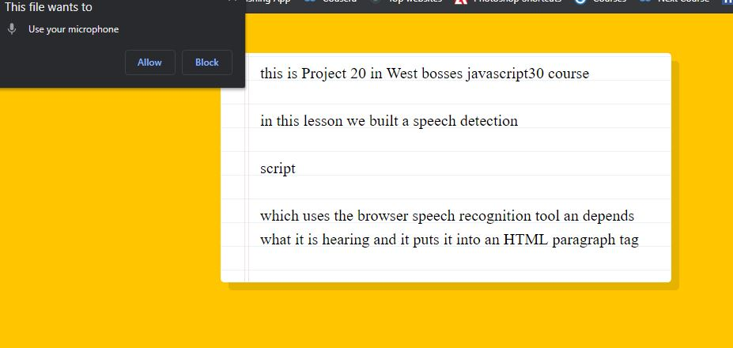

# SpeechDetection

This is project 20 in Wes Bos' JavaScript 30 course.  In this lesson we built a Speech Decection script which uses the browsers Speech Recognition tool and appends what it is hearing and outputs it into an HTML paragraph tag.  This project used mostly JavaScript, however it did require using Node.js and MAMP for a secure origin.

This was a really fun lesson, if you're interested in doing the project yourself, you can find the video <a href="https://www.youtube.com/watch?v=0mJC0A72Fnw&list=PLu8EoSxDXHP6CGK4YVJhL_VWetA865GOH&index=20">here.</a>

